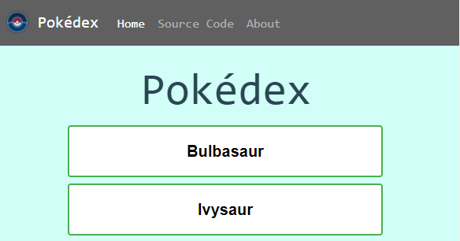

# Simple JavaScript App (Pokédex)

This is Pokédex Web App that displays Pokémon details using an API (App Programing Interface).

A web application built using HTML, CSS, JavaScript, Jquery and Bootstrap that loads data from an external API ('https://pokeapi.co/'). This app displays a Modal window upon clicking on a pokemon's name enabling the user to find out more detail information about the Pokémons such as their height and type.  Moreover, an image of the pokémon is also displayed.

# Project Description

This project is designed to mimic the Pokédex found in the cartoon show Pokémon and is built using HTML, Bootstrap, some CSS and JavaScript. The Pokédex will load the Pokémon data from an external API. A list of Pokémon will be displayed which will show Pokémon details if clicked on.

# Goal

Integrating a Bootstrap framework instead of using pure CSS.

# How to Run

By using the index.html file. Tested on Crome , Brave and Firefox.

# Setup and Dependencies

    "Bootstrap Ver 4.5.0",
    "eslint": "^7.17.0",
    "eslint-config-node": "^4.1.0",
    "eslint-config-prettier": "^7.1.0",
    "eslint-plugin-node": "^11.1.0",
    "eslint-plugin-prettier": "^3.3.1",
    "prettier": "^2.2.1"

# Environment
  - VS Code:  v1.61.2
  - npm v7.24.1
  - Node.js v14.15.4
  
  